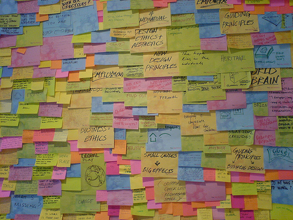

!SLIDE

# Inherited Resources

!SLIDE

# Делает из

    @@@ ruby
    class TricksController < ApplicationController
      # GET /tricks
      # GET /tricks.xml

      def index
        @tricks = Trick.all
        respond_to do |format|
          format.html # index.html.erb
          format.xml  { render :xml => @tricks }
        end
      end

      # И еще 70 строк в этом духе
    end

!SLIDE

# Вот это

    @@@ ruby
    class TricksController < InheritedResources::Base
    end

!SLIDE center

# Дьявол-то в деталях

!SLIDE

## Наследовать нельзя расширять

    @@@ ruby
    class TricksController < ApplicationController
      inherit_resources
    end

!SLIDE

## Я — педант

    @@@ ruby
    class TricksController < InheritedResources::Base
      actions :index, :show
    end

    class TricksController < InheritedResources::Base
      actions :all, :except => [:destroy]
    end

!SLIDE

## У меня все запущенно

    @@@ ruby
    class TricksController < InheritedResources::Base
      defaults :resource_class => Joke,
               :collection_name => 'jokes',
               :instance_name => 'joke'
    end

!SLIDE

## У меня все по полочкам

    @@@ ruby
    # Namespaces просто работают
    class Admin::TricksController < InheritedResources::Base
    end

    # И еще настраиваются
    class Administration::TricksController < InheritedResources::Base
      defaults :route_prefix => 'admin'
    end

!SLIDE

## У меня все по полочкам

    @@@ ruby
    # /trickster/1/tricks
    class TricksController < InheritedResources::Base
      belongs_to :trickster
    end

    # /tricksters/jose/tricks
    # /tricksters/:trickster_name/tricks
    class TricksController < InheritedResources::Base
      belongs_to :trickster,
                 :finder => 'find_by_name!',
                 :param  => 'trickster_name'
    end

    # /trickster/1/tricks
    # /tricks
    class TricksController < InheritedResources::Base
      belongs_to :trickster, :optional => true
    end

!SLIDE

## У меня все по полочкам

    @@@ ruby
    # /trickster/1/tricks/1/comments
    class CommentsController < InheritedResources::Base
      nested_belongs_to :trickster, :ticks
    end

    # /trickster/1/comments
    # /tricks/1/comments
    class CommentsController < InheritedResources::Base
      belongs_to :trickster, :tricks, :polymorphic => true
    end

    # /trickster/1/tricks
    # /tricks
    class TricksController < InheritedResources::Base
      belongs_to :trickster, :optional => true
    end

!SLIDE

## У меня все по полочкам

    @@@ ruby
    # /trickster/jose/tricks/1/comments
    class CommentsController < InheritedResources::Base
      belongs_to :trickster, :finder => 'find_by_name!', :param => :trickster_name do
        belongs_to :trick
      end
    end

    # /trickster/1/tricks/1/comments
    # /trickster/1/jokes/1/comments
    # /tricks/1/comments
    class CommentsController < InheritedResources::Base
      belongs_to :trickster do
        belongs_to :tricks, :jokes, :polymorphic => true
      end
    end

!SLIDE

## У меня все по полочкам

    @@@ ruby
    # /tricks/1/trickster
    class TrickstersController < InheritedResources::Base
      belong_to :trick, :singleton => true
    end

!SLIDE

## У меня все сложно

    @@@ ruby
    class TricksController < InheritedResources::Base
      private
        def begin_of_association_chain
          @current_user
        end
    end

    class TricksController < InheritedResources::Base
      private
        def collection
          @tricks || end_of_association_chain.
            paginate(:page => params[:page])
        end
    end

!SLIDE

## У меня все не как у людей

    @@@ ruby
    class TricksController < InheritedResources::Base
      def destroy
        destroy! do |format|
          format.html { redirect_to root_url }
        end
      end
    end

    class TricksController < InheritedResources::Base
      def destroy
        destroy! do |format|
          format.html { root_url }
        end
      end
    end

    class TricksController < InheritedResources::Base
      def destroy
        destroy! { root_url }
      end
    end

!SLIDE

## У меня все не как у людей

    @@@ ruby
    class TricksController < InheritedResources::Base
      def destroy
        destroy!(:notice => 'БДЫЩЬ!')
      end
    end

    class TricksController < InheritedResources::Base
      def update
        update! do |success, failure|
          failure.html { redirect_to trick_path(@trick) }
        end
      end
    end

!SLIDE

## У меня все не как у людей

    @@@ ruby
    class TricksController < InheritedResources::Base
      include InheritedResources::DSL

      update! do |success, failure|
        failure.html { redirect_to trick_path(@trick) }
      end
    end

!SLIDE

# А что в views?

!SLIDE

## Переменные

    @@@ ruby
    @trick, @tricks

## Helpers

    @@@ ruby
    resource #=> @trick
    resources #=> @tricks
    resource_class #=> Trick

!SLIDE

## URL Helpers

    @@@ ruby
    resource_url               # => /tricks/#{@trick.to_param}
    resource_url(trick)        # => /tricks/#{trick.to_param}
    # new_resource_url, edit_resource_url
    collection_url             # => /tricks
    parent_url                 # => /

!SLIDE bullets incremental

# Responders

* FlashResponder
* HttpCacheResponder

!SLIDE bullets incremental

# Зачем?

* Экономит время
* Не нужно тестировать контроллеры
* Дисциплинирует
